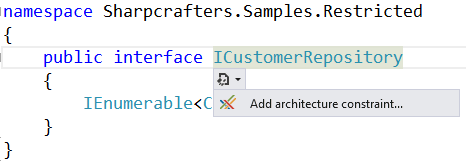
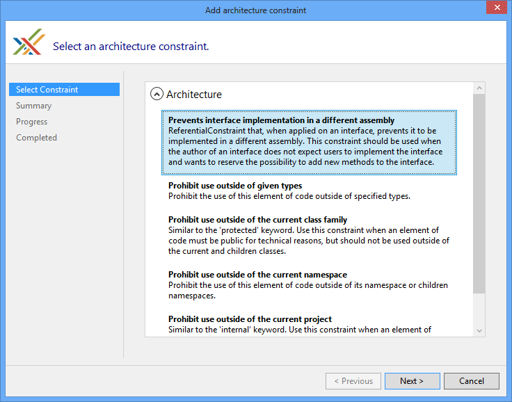
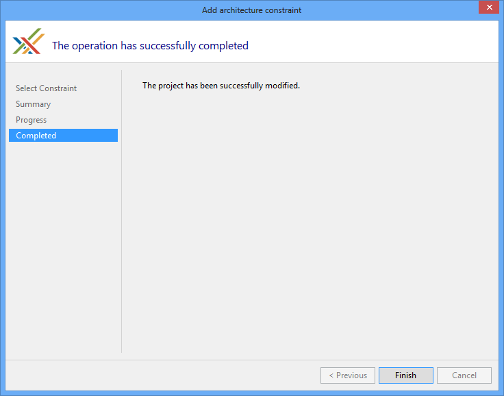

# Restricting Interface Implementation

Under some circumstances, you may want to restrict users of an API to implement an interface. You may want to allow them to consume the interface but not to implement it in their own classes, so that, later, you can add new members to this interface without breaking the user's code. If retaining the interface as a public artifact is required, the programming language does not give you any option to enforce the desired restriction. Enter the <xref:PostSharp.Constraints.InternalImplementAttribute> from PostSharp. 


## Adding the constraint to the interface

To restrict implementation of publicly declared interfaces you simply need to add [<xref:PostSharp.Constraints.InternalImplementAttribute>] to that interface. 

> [!NOTE]
> This procedure requires [PostSharp Tools for Visual Studio](https://visualstudiogallery.msdn.microsoft.com/a058d5d3-e654-43f8-a308-c3bdfdd0be4a) to be installed on your machine. You can however achieve the same results by editing the code and the project manually. 

### 

1. Place the caret over the interface that you want to add the attribute select the "Add architectural constraint...".

    


2. Select "Prevent interface implementation in a different assembly" and select **Next**. 

    


3. Verify that you will be adding the <xref:PostSharp.Constraints.InternalImplementAttribute> attribute to the correct piece of code. 

    


4. Once the download, installation and configuration of PostSharp have finished you can close the wizard and look at the changes that were made to your codebase.

    


5. You'll notice that the only thing that has changed in the code is the addition of the [<xref:PostSharp.Constraints.InternalImplementAttribute>] attribute. 

    ```csharp
    [InternalImplement] 
    public interface ICustomerRepository 
    { 
        IEnumerable<Customer> FetchAll(); 
    }
    ```


Once that is done, implementing the interface that was decorated with the <xref:PostSharp.Constraints.InternalImplementAttribute> from another assembly will create a compile time warning. 


> [!NOTE]
> To perform this architectural validation the project that is trying to implement the interface will need to be processed by PostSharp.


## Emitting an error instead of a warning

If a warning isn't strong enough for your environment you can change the output to a compile time error by setting the <xref:PostSharp.Constraints.InternalImplementAttribute> to have a `Severity type` of `Error`. 

```csharp
[InternalImplement(Severity = SeverityType.Error)] 
public interface ICustomerRepository 
{ 
    IEnumerable<Customer> FetchAll(); 
}
```

Now any reference to the decorated interface from another assembly will generate an error and fail the compilation of your project.


## Ignoring warnings

If you are trying to implement a constrained interface in a separate assembly and you want to override the warning being generated there is a solution available for you. The <xref:PostSharp.IgnoreWarningAttribute> attribute can be applied to stop warnings from being generated. 

> [!NOTE]
> The <xref:PostSharp.IgnoreWarningAttribute> attribute will only suppress warnings. If you have escalated the warnings to be errors, those errors will still be generated even if the <xref:PostSharp.IgnoreWarningAttribute> attribute is present. 

To suppress warnings all that you need to do is add the <xref:PostSharp.IgnoreWarningAttribute> attribute to the offending piece of code. In this example, we would suppress the warning being generated by adding the attribute to the class that is implementing the constrained interface. Once we have done that, the warning generated for that specific implementation would be suppressed. All other locations that are implementing this interface will continue to generate their warnings. 

> [!NOTE]
> You may wonder where the identifier `AR0101` comes from. <xref:PostSharp.IgnoreWarningAttribute> actually works with any PostSharp warning and not just this one. Any build error, whether from MSBuild, C# or PostSharp, has an identifier. To see error identifiers in Visual Studio, open the View menu and click on the Output item, select "Show output from: Build". You will see warnings including their identifiers. 

```csharp
[IgnoreWarning("AR0101")] 
public class PreferredCustomerRepository : ICustomerRepository 
{ 
    public IEnumerable<Customer> FetchAll() 
    { 
        return null; 
    } 
}
```

## See Also

**Reference**

<xref:PostSharp.Constraints.InternalImplementAttribute>
<br><xref:PostSharp.IgnoreWarningAttribute>
<br>**Other Resources**

<xref:control-visibility>
<br>