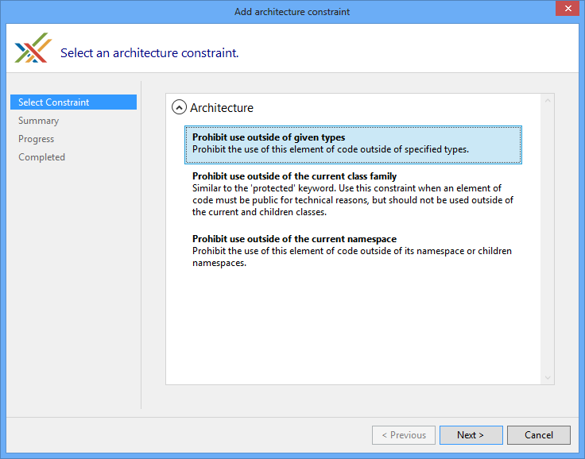
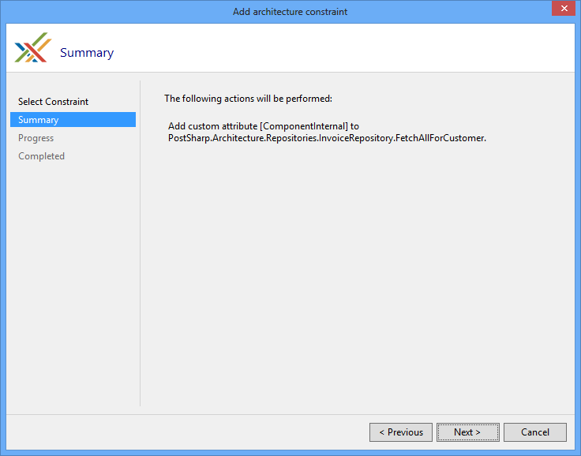
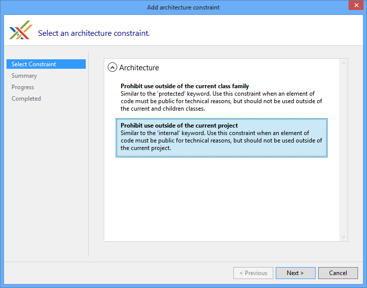

# Controlling Component Visibility Beyond Private and Internal

When you are working on applications it's common to run across situations where you want to restrict access to a component you have written. Usually, you control this access using the private and/or internal keywords when defining the component. A class marked as internal can be accessed by any other class in the same assembly, but that may not be the level of restriction needed within the codebase. Access to a private class is restricted to those components that are inside the same class or struct that contains the private class, which prevents any other classes from accessing it. In one situation we are restricting access to the component to only the class or struct that contains it. In the other situation, we are allowing access to the component from any other component that is in the same assembly. What if needed something in between?

PostSharp offers the ability to define component access rules that exist between the scope of the internal and private keywords. This gives us the opportunity to restrict access to a component only from other components in the same namespace. We can also restrict access to a select few other components.

As an example let's look at a data access related class. As a precaution against developer's circumventing our data access structure we want to limit access to this repository class.


## Restricting access to specific namespaces

> [!NOTE]
> This procedure requires [Visual Studio Tools for Metalama and PostSharp](https://marketplace.visualstudio.com/items?itemName=PostSharpTechnologies.PostSharp) to be installed on your machine. You can however achieve the same results by editing the code and the project manually. 

### To limit access of a class only to other classes within the validation namespace:

1. Put the caret on the `internal` class that should have restricted access. Select "Add architectural constraint..." from the smart tag options. 

    


2. Select "Prohibit use outside of given types" from the list of options.

    


3. Verify that you will be adding the <xref:PostSharp.Constraints.ComponentInternalAttribute> attribute to the correct piece of code. 

    


4. Once the download, installation and configuration of PostSharp have finished you can close the wizard and look at the changes that were made to your codebase.

    


5. You'll notice that the only thing that has changed in the code is the addition of the [<xref:PostSharp.Constraints.ComponentInternalAttribute>] attribute. 

    ```csharp
    namespace Sharpcrafters.Crm.Console.Repositories 
    { 
        public class InvoiceRepository 
        { 
                [ComponentInternal] 
                internal IEnumerable<Invoice> FetchAllForCustomer(Guid id) 
                { 
                    //dostuff 
                    return null; 
                } 
         } 
    }
    ```


6. The [<xref:PostSharp.Constraints.ComponentInternalAttribute>] attribute is templated to accept a string for the namespace that should be able to access this method. There are two options that you could use. The first is to pass the attribute an array of `typeof(...)` values that represents the types that can access this method. The second option is to pass in an array of strings that contain the namespaces of the code that should be able to access this method. For our example, replace the `typeof(TODO)` with a string for the validation namespace. 


7. If you try to access this component from a namespace that hasn't been granted access you will see a compile time warning in the Output window.

    ```csharp
    namespace Sharpcrafters.Crm.Console.Services 
    { 
        public class InvoiceServices 
        { 
              public IEnumerable<InvoiceForList> FetchAllInvoicesForCustomer(Guid id) 
              { 
                  var invoiceRepository = new InvoiceRepository(); 
     
                  var allInvoices = invoiceRepository.FetchAllForCustomer(id); 
                  return 
                      allInvoices.Where(x => !x.PaidInFull).Select( 
                          x => new InvoiceForList 
                              { 
                                  PurchaseDate = x.PurchaseDate,  
                                  ShipDate = x.ShipDate,  
                                  TotalAmount = x.Total 
                               }); 
              } 
          } 
    }
    ```

    

    > [!NOTE]
    > If you are trying to access the component from a namespace that is in a different project you will need PostSharp to process that project for the validation to occur.


## Restricting access to specific types

Under some circumstances, namespace level restrictions may not be tight enough for your needs. In that situation, you have the ability to apply this constraint at a type level.


### 

1. To restrict access at a component type level you need to explicitly define which component types will have access. This is done by passing types into the constructor of the <xref:PostSharp.Constraints.ComponentInternalAttribute> attribute's constructor. The construct accepts an array of `Type` which allows you to define many different component types that should be granted access. 

    ```csharp
    public class InvoiceRepository 
    { 
        [ComponentInternal(typeof(Sharpcrafters.Crm.Console.Services.InvoiceServices))] 
        internal IEnumerable<Invoice> FetchAllForCustomer(Guid id) 
        { 
            //dostuff 
            return null; 
        } 
    }
    ```


2. Now if you try to access this component from a type that hasn't been granted access you will see a compile time warning in the Output window.

    ```csharp
    public class CustomerServices 
    { 
        public IEnumerable<Customer> FetchAll() 
        { 
            var invoiceRepository = new InvoiceRepository(); 
            var allInvoices = invoiceRepository.FetchAllForCustomer(Guid.NewGuid()); 
        } 
    }
    ```

    


## Controlling component visibility outside of the containing assembly

Because of framework limitations or automated testing requirements you sometimes need to declare components as public so that you can perform the desired tasks or testing. For some of those components, you probably don't want external applications accessing them. For instance, WPF controls need a default constructor for use in the designer, but sometimes you want another constructor to be used at run time, so you want to prevent the default constructor to be used from code.

PostSharp offers you the ability to decorate a publically declared component in such a way that it is not accessible by applications that reference its assembly. All you need to do is apply the <xref:PostSharp.Constraints.InternalAttribute> attribute. 


### 

1. Let's mark the `Customer` class so that it can only be accessed from the assembly it resides in. 

    ```csharp
    namespace Sharpcrafters.Crm.Core 
    { 
        public class Customer 
        { 
            public int Id { get; set; } 
            public string Name { get; set; } 
        } 
    }
    ```


2. Place the caret on the publically declared component that you want to restrict external access to and expand the smart tag. Select "Add architectural constraint" This procedure requires [Visual Studio Tools for Metalama and PostSharp](https://marketplace.visualstudio.com/items?itemName=PostSharpTechnologies.PostSharp) to be installed on your machine. You can however achieve the same results by editing the code and the project manually. . 

    


3. When prompted to select a constraint, choose to "Prohibit use outside of the project".

    


4. The summary page gives you the opportunity to review the selections that you have made. If you notice that the configuration is not what you wanted you can click the **Previous** button and adjust your selections. If the configuration meets your needs click **Next**. In this demo, you will see that the [<xref:PostSharp.Constraints.InternalAttribute>] attribute is being added to the `Customer` class. 

    


5. Once the download, installation and configuration of PostSharp have finished you can close the wizard and look at the changes that were made to your codebase.

    


6. You'll notice that the only thing that has changed in the code is the addition of the [<xref:PostSharp.Constraints.InternalAttribute>] attribute. 

    ```csharp
    namespace Sharpcrafters.Crm.Core 
    { 
        [Internal] 
        public class Customer 
        { 
            public int Id { get; set; } 
            public string Name { get; set; } 
        } 
    }
    ```


7. When you attempt to make use of that public component in a different assembly a compile time warning will appear in the Output window.

    ```csharp
    namespace Sharpcrafters.Crm.Console.Repositories 
    { 
        public class CustomerRepository:ICustomerRepository 
        { 
            public IEnumerable<Customer> FetchAll() 
            { 
                return new List<Customer>{new Customer{Id=1,Name="Joe Johnson"}}; 
            } 
        } 
    }
    ```

    > [!NOTE]
    > The assembly that is attempting to use the public component will need to reference PostSharp for this validation to occur.


## Emitting errors instead of warnings

By default, any situation that breaks the access rules defined by the application of the <xref:PostSharp.Constraints.ComponentInternalAttribute> or <xref:PostSharp.Constraints.InternalAttribute> attribute will generate a compile time warning. It's possible to escalate this warning to the error level. 


### 

1. Changing the output warning to an error requires you to set the <xref:PostSharp.Constraints.ComponentInternalAttribute.Severity> level. 

    ```csharp
    [ComponentInternal(typeof (InvoiceServices), Severity = SeverityType.Error)] 
    public IEnumerable<Invoice> FetchAllForCustomer(Guid id) 
    { 
        //dostuff 
        return null; 
    }
    ```


2. Now when you try to access the component when access hasn't been granted the Output window will display an error message.

    


## Ignoring warnings

There may be specific situations where you want to suppress the warning message that is being generated at compile time. In those cases, you can apply the <xref:PostSharp.Extensibility.SuppressWarningAttribute> attribute to the locations where you want to allow access to the component. 

> [!NOTE]
> The <xref:PostSharp.Extensibility.SuppressWarningAttribute> attribute will only suppress warnings. If you have escalated the warnings to be errors, those errors will still be generated even if the <xref:PostSharp.Extensibility.SuppressWarningAttribute> attribute is present. 

If you wanted to allow access to the constrained component in a specific method you could add the <xref:PostSharp.Extensibility.SuppressWarningAttribute> attribute to that method. 

```csharp
public class CustomerServices 
{ 
    [IgnoreWarning("AR0102")] 
    public IEnumerable<Customer> FetchAll() 
    { 
        var invoiceRepository = new InvoiceRepository(); 
        var allInvoices = invoiceRepository.FetchAllForCustomer(Guid.NewGuid()); 
    } 
}
```

> [!NOTE]
> `AR0102` is the identifier of the warning emitted by <xref:PostSharp.Constraints.ComponentInternalAttribute>. To ignore warnings emitted by `Internal`, use the identifier `AR0104`. 
You may wonder where these identifiers come from. <xref:PostSharp.Extensibility.SuppressWarningAttribute> actually works with any PostSharp warning and not just this one. Any build error, whether from MSBuild, C# or PostSharp, has an identifier. To see error identifiers in Visual Studio, open the View menu and click on the Output item, select "Show output from: Build". You will see warnings including their identifiers. 

If you wanted to allow access in an entire class you could add the <xref:PostSharp.Extensibility.SuppressWarningAttribute> attribute at the class level. Any access to the constrained component within the class would have its warning suppressed. 

```csharp
[IgnoreWarning("AR0102")] 
public class CustomerServices 
{ 
    public IEnumerable<Customer> FetchAll() 
    { 
        var invoiceRepository = new InvoiceRepository(); 
        var allInvoices = invoiceRepository.FetchAllForCustomer(Guid.NewGuid()); 
    } 
}
```

## See Also

**Reference**

<xref:PostSharp.Extensibility.SuppressWarningAttribute>
<br><xref:PostSharp.Constraints.ComponentInternalAttribute>
<br><xref:PostSharp.Constraints.InternalAttribute>
<br>**Other Resources**

<xref:custom-constraints>
<br>
