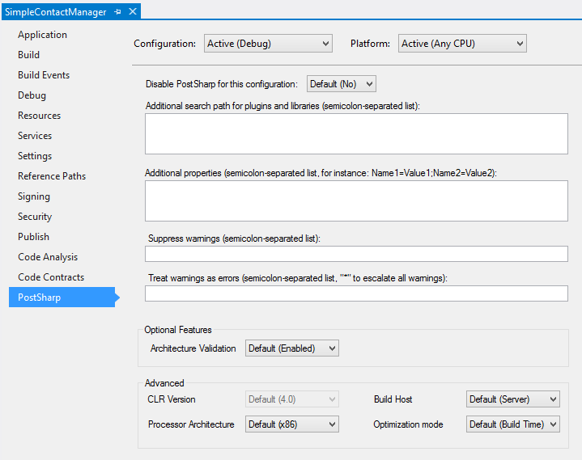

# Configuring Projects in Visual Studio

PostSharp accepts several configuration settings such as the version and processor architecture of the CLR that is used at build time, the search path of dependencies, and whether some features are enabled.

Although the default configuration is appropriate for most situations, you may have to fine-tune some of them to cope with particular cases.

This article describes how to configure the settings in Visual Studio. You can also edit the MSBuild properties directly in a text editor. For details, see <xref:configuration-msbuild>. 

> [!NOTE]
> Starting from Visual Studio 2022, the project properties tab is no longer available for SDK-style projects. Instead, you should edit the MSBuild properties using the text editor.

## Editing properties in Visual Studio

### To open the PostSharp project property page in Visual Studio

1. Open the **Solution Explorer**. 

2. Right-click on the project then select **Properties** at the bottom of the menu. 

3. Select the **PostSharp** tab. 

## Explanation of configuration settings

Note that all settings are dependent on the selected project configuration (for instance `Debug`) and platform (for instance `Any CPU`). 

| Setting | MSBuild property name | Description |
|---------|-----------------------|-------------|
| Disable PostSharp | `SkipPostSharp` | `True` if PostSharp should not execute in for the selected configuration and platform, otherwise `False`.  |
| Additional search path | `PostSharpSearchPath` | A semicolon-separated list of directories where plug-ins and libraries have to be searched for. This property can reference other MSBuild properties, for instance: `..\MyWeaver\bin\$(Configuration)`. All project references are already added to the search path by default.  |
| Additional properties | `PostSharpProperties` | A semicolon-separated list of property definition, for instance: `Name1=Value1;Name2=Value2`. This property can reference other MSBuild properties, for instance: `RootNamespace=$(RootNamespace)`. Several properties are defined by default; for details, see <xref:configuration-postsharp>.  |
| Suppress warnings | `PostSharpDisabledMessages` | A semicolon-separated list of warning identifiers that must be ignored, or `*` if all warnings have to be ignored.  |
| Treat warnings as errors | `PostSharpEscalatedMessages` | A semicolon-separated list of warning identifiers that must be escalated into errors, or `*` if all warnings must be treated as errors.  |
| Architecture Validation | `PostSharpConstraintVerificationEnabled` | `Enabled` if constraints must be validated, otherwise `Disabled`. The default value is `Enabled`. For details regarding architecture validation, see <xref:constraints>.  |
| CLR Version | `PostSharpTargetFrameworkVersion` | The version of the CLR that hosts PostSharp. PostSharp currently only supports the CLR 4.0 so this setting is disabled. |
| Processor Architecture | `PostSharpTargetProcessor` | The processor architecture (`x86` or `x64`) of the process hosting PostSharp. Since PostSharp needs to execute the current project during the build, the processor architecture of the PostSharp process must be compatible with the target platform of the current project. The default value is `x86`, or `x64` if the target platform of the current project is `x64`.  |
| Build Host | `PostSharpHost` | The kind of process hosting PostSharp, which influences the assembly loading mechanism, compatibility and performance features. See [hosting-properties](xref:msbuild-properties#hosting-properties).  |
| Optimization Mode | `PostSharpOptimizationMode` | When set to `Build Time`, PostSharp will use a faster algorithm to generate the final assembly. When set to `Size`, PostSharp will use a slower algorithm that generates smaller assemblies. The default value is `Build Time` by default, or `Size` when the C# or VB compiler is set to generate optimal code (typically, in release builds).  |

