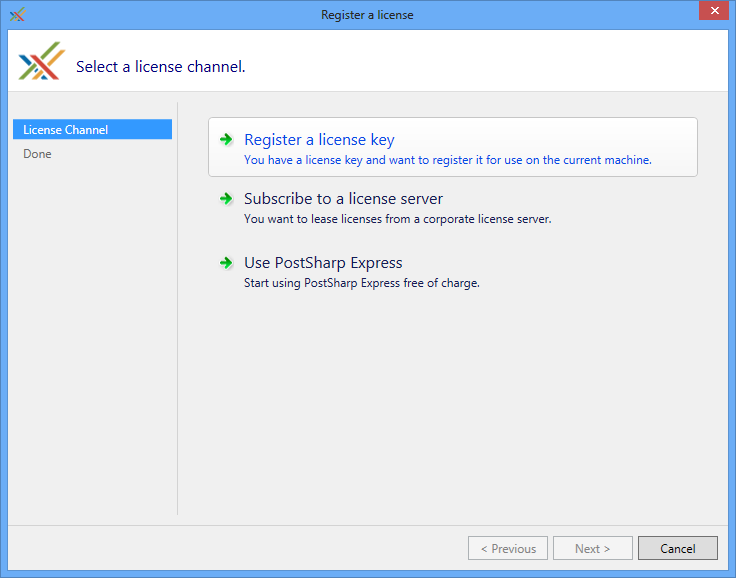
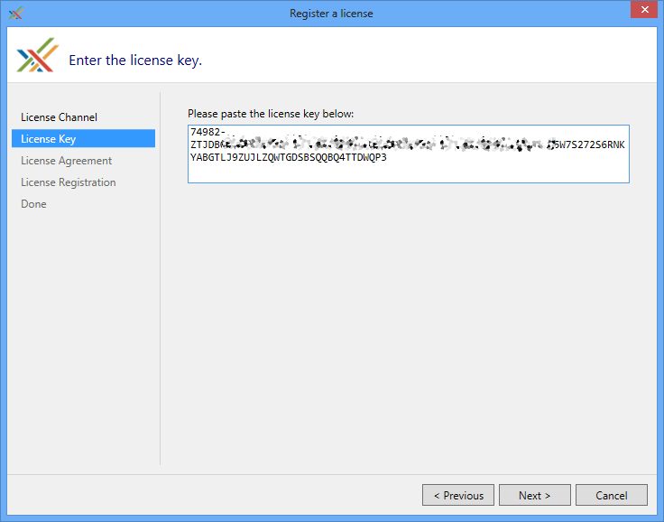
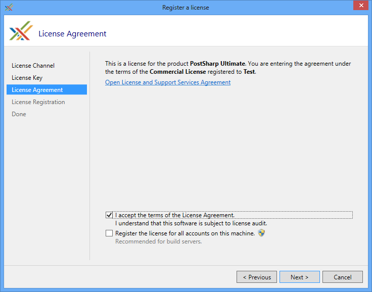
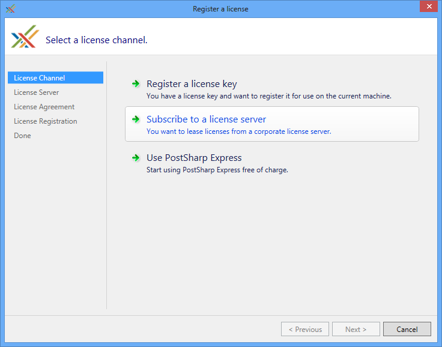
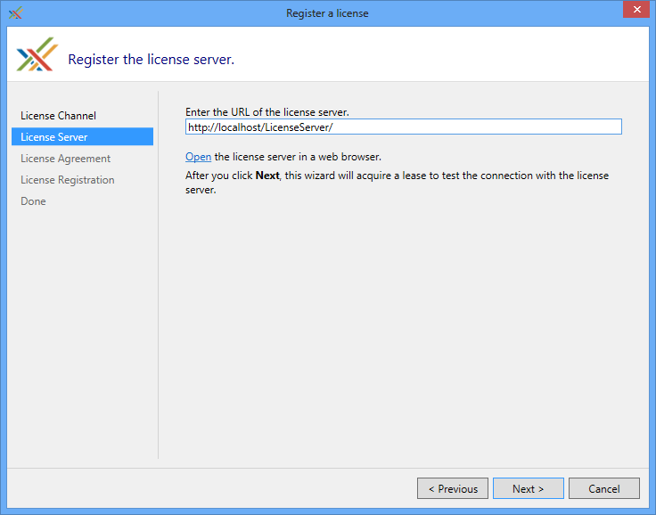
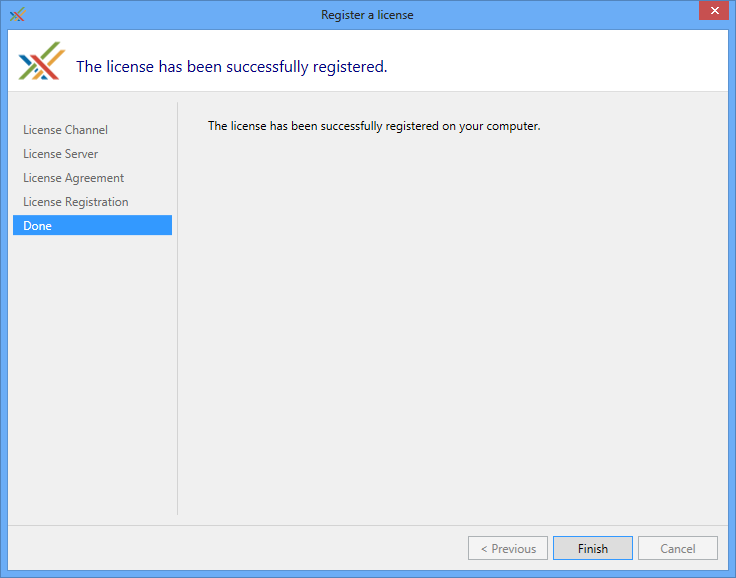

# Deploying License Keys

This section explains how to install PostSharp license keys.
Whether you are using a free or commercial edition, PostSharp requires you to enter a license key before being able to build a project.


## Configuring the license key in your source code

It is possible to install the license key in your source control, so that these settings are automatically applied during the build.


### To install the license key in source control:

1. Create a file named *postsharp.config* in the root directory of your source repository, or in any parent directory of the Visual Studio project file (**.csproj* or **.vbproj*). 


2. Add the following content to the *postsharp.config* file: 

    ```xml
    <?xml version="1.0" encoding="utf-8"?>
    <Project xmlns="http://schemas.postsharp.org/1.0/configuration">
      <License Value="000-AAAAAAAAAAAAAAA"/>
    </Project>
    ```

    In this code, *000-AAAAAAAAAAAAAAA* must be replaced by the license key or the URL to the license server. 


See <xref:configuration-system> for details about this configuration file. 


## Registering a license key using the user interface

Registering a license key using the user interface is the preferred procedure for individual developers and small teams.

It's easier to do it when PostSharp Tools for Visual Studio are installed, but you can also do it without them.


### To open the licensing UI with PostSharp Tools for Visual Studio:

1. Open Visual Studio.


2. Click on menu **PostSharp**, then **Options**. 


3. Open the **License** option page. 

You should now see the following dialog box:


### To open the licensing UI without PostSharp Tools for Visual Studio:

1. Build a project that contains PostSharp. The build does not need to be successful.
2. Open the `C:\ProgramData\PostSharp` directory with Windows Explorer.
3. Find the subdirectory whose name is the highest version number (it generally does not matter if it does not pick exactly the latest build).
4. From this directory, find `.\bin.Release\net472\UserInterface\PostSharp.Settings.UI.exe` and execute it.
5. Unfold the _Manage License_ panel.

You should now see the following dialog box:


### To install a license key with the licensing UI:

1. Open the licensing UI as described above.

2. Click on the **Register a license** link. 

3. Click on **Register a license**. 

    


4. Paste the license key and click **Next** . 

    


5. Read the license agreement and check the option **I agree**. Click on **Next**. 

    

    > [!TIP]
    > If you are registering the license key on a build server, also check the option **Register these settings for all accounts on this machine.** 


6. Click **Next** on the notice regarding license metering. 


## Subscribing to a license server

If the license audit is not acceptable in your company for regulatory or other reasons, you can consider using the PostSharp License Server.

In this topic, we assume that the license server has already been installed by your organization. If you need to install the license server, see <xref:license-server-admin>. 


### To subscribe to a license server using the user interface:

1. Open the licensing UI as described above.


2. Click on the **Subscribe to a license server** link. 

    


5. Paste the URL of the license server. You can click on the **Open** hyperlink to verify that the URL is correct and that you have access to it. Click **Next**. 

    


3. Read the license agreement and check the option **I accept**. Click on **Next**. 

    

    > [!TIP]
    > If you are registering the license server on a build server, also check the option **Register the license for all accounts on this machine.** 


4. You are done.

    


## Configuring the license server registration in your source code

It is possible to subscribe to the license server using a file stored in your source control system by using the exact same mechanism as to register a license key.


### To install license settings in your source control system:

1. Create a file named *postsharp.config* in the root directory of your source repository, or in any parent directory of the Visual Studio project file (**.csproj* or **.vbproj*). 


2. Add the following content to the *postsharp.config* file: 

    ```xml
    <?xml version="1.0" encoding="utf-8"?>
    <Project xmlns="http://schemas.postsharp.org/1.0/configuration" x:xmlns="http://schemas.postsharp.org/1.0/configuration">
      <License Value="http://server/path"/>
    </Project>
    ```

    In this code, *http://server/path* must be replaced by the URL to the license server. 


See <xref:configuration-system> for details about this configuration file. 


## Deploying the license key as an environment variable

There are two situations when you may consider using an environment variable to configure PostSharp licensing: when configuring build agents, and when configuring a large number of development machines using management tools such as Active Directory Group Policies or Microsoft Intune.

The environment variable to set is named PostSharpLicense. It must be set to the license key itself or to the URL of the license server.

